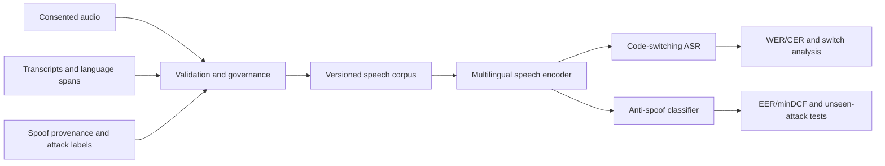

# Kazakh–Russian Speech Intelligence

Research on code-switching automatic speech recognition and robust detection of synthetic or spoofed speech.

> **Status:** research concept and reproducible project scaffold. No trained model, benchmark result, or production detector is published yet.

The project studies two connected problems for speech used in Kazakhstan:

1. **Kazakh–Russian code-switching ASR** — transcription that preserves the spoken language, script, named entities, and switch boundaries;
2. **Voice anti-spoofing** — detection and analysis of replayed, converted, cloned, and otherwise synthetic speech.

The shared research core is a consented, documented audio pipeline and multilingual speech representation. Each task keeps its own labels, evaluation protocol, risks, and release criteria.

## Research questions

- Which multilingual adaptation strategy best improves code-switched recognition without degrading monolingual Kazakh?
- How should tokenisation, script normalisation, and language tags be evaluated around switch boundaries?
- How well do anti-spoofing models generalise to unseen generators, codecs, channels, microphones, and noise?
- Can shared representations help both tasks without leaking speaker identity or creating unsafe voice artefacts?

## Proposed system



## MVP and evaluation

The first 12 weeks target a small, auditable benchmark and reproducible baselines rather than a production voice product.

| Track | Primary evaluation |
| --- | --- |
| Code-switching ASR | WER, CER, language-aware error rate, switch-boundary errors |
| Anti-spoofing | EER, minDCF, ROC/PR-AUC, calibration |
| Robustness | unseen generator, codec, device, noise, and speaker partitions |
| Efficiency | real-time factor, memory, and latency on stated hardware |

Results must be broken down by language, switch density, speaker group where ethically and statistically appropriate, acoustic condition, and attack family. Speaker-disjoint test sets are mandatory.

## Data principles

- collect or use speech only with a documented legal basis, licence, and consent compatible with the intended research;
- minimise stored identity information and restrict access to raw voice data;
- never train a voice-cloning model as an unreviewed by-product of detection work;
- keep immutable manifests for audio, transcript, speaker partition, attack provenance, and transformations;
- publish only artefacts whose consent and licence permit redistribution.

The full rules are in [Data and ethics](docs/data-and-ethics.md).

## Repository layout

```text
configs/       Experiment configuration contracts
data/          Dataset manifests and local-data rules
docs/          Research plan, data governance, and threat model
models/        Model-card location; weights remain external
notebooks/     Exploration only; reusable logic belongs in src/
src/           Python package
tests/         Automated checks
```

## Local setup

Requirements: Python 3.11+ and Git.

```bash
python -m venv .venv
# Windows PowerShell: .venv\Scripts\Activate.ps1
# Linux/macOS: source .venv/bin/activate
python -m pip install --upgrade pip
pip install -e ".[dev]"
pytest
```

Raw audio, transcripts containing personal information, credentials, checkpoints, and generated samples must not be committed.

## 12-week roadmap

- **Weeks 1–4:** define consent/licensing rules, annotation schema, speaker-disjoint splits, and strong public-data baselines.
- **Weeks 5–8:** adapt and compare ASR models; train anti-spoof baselines and run codec/channel robustness experiments.
- **Weeks 9–12:** test unseen conditions, calibrate scores, document failure modes, and package a restricted research demo.

Detailed hypotheses and exit criteria are in the [research plan](docs/research-plan.md).

## Responsible use

Anti-spoofing scores are probabilistic and can be evaded or become obsolete as generators change. They must not be the sole basis for fraud accusations, identity decisions, employment actions, or denial of service. ASR output may contain harmful transcription errors and must not be treated as a verified record without human review.

## Contributing and citation

Read [CONTRIBUTING.md](CONTRIBUTING.md) before proposing data or models. Report vulnerabilities and sensitive-data exposure through [SECURITY.md](SECURITY.md). Citation metadata is in [CITATION.cff](CITATION.cff).

## License

Code is licensed under the [MIT License](LICENSE). Speech corpora, transcripts, generated audio, model weights, and third-party assets retain separate licences and access constraints.

---

**Кратко по-русски:** проект исследует распознавание казахско-русской речи с переключением языков и обнаружение синтетического/поддельного аудио. Первый результат — воспроизводимые baseline-модели, speaker-disjoint benchmark, анализ ошибок и ограниченный исследовательский demo с прозрачными ограничениями.
