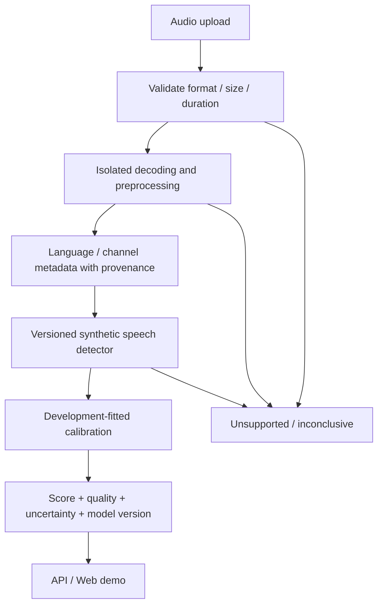

# VAIS Voice — proposed audio-authenticity pipeline

All components are planned. The existing Python package is a scaffold.

## Components

1. Detection Model: real vs synthetic; baseline comparison with explicit input normalization.
2. Robustness: unknown generators, codec/noise/duration shifts, re-recording and repeated encoding.
3. Benchmark: protected corpus, split audit, calibration and reproducible reports; not a separate product.

Language/channel metadata can be supplied, estimated or unknown. Codec container does not prove processing history. Do not disguise estimates as known facts. Metadata must not leak labels or generator identity to the detector.

## Planned code boundaries

Within the current package, future `detection/`, `preprocessing/` and `evaluation/` modules should own inference, safe audio normalization and metrics. Future `api/` and `web/` components should consume a versioned report contract. These directories/services are not implemented yet.

## Planned report contract

Request ID; filename; duration, sample rate and codec/container; language/channel label and provenance; model and preprocessing version; raw score and its direction; optional calibrated synthetic probability with calibrator ID and validation scope; quality checks; uncertainty method; abstention reason; retention/deletion status.

The main score is named **synthetic score**: higher means more synthetic-like. The report title “authenticity” must not invert that direction. A calibrated probability is optional, distribution-dependent and is never a probability of criminal intent. Return null/not available rather than invented confidence.

## Security boundaries

Validate media contents, not just extensions. Isolate decoder execution, limit resources, remove uploads according to retention policy, restrict evidence access and redact logs. Never accept arbitrary remote URLs in the initial upload design. No reuse for training without separate documented permission.

## Later phases

Streaming, batch processing, enterprise/on-prem delivery and replay/other anti-spoof scenarios need separate design and validation.
