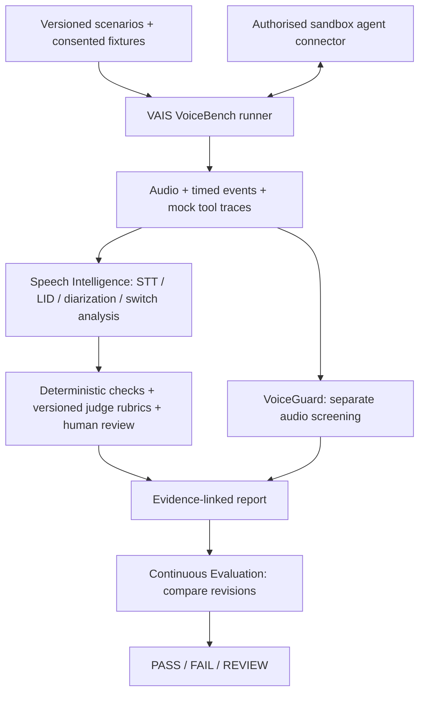

# VAIS Voice — proposed architecture

All components below are planned. The Python package is a scaffold only.

## Boundaries

- **VoiceBench:** execution and expected behaviours; simulated personas use licensed or consented voices, not unapproved impersonation.
- **VoiceGuard:** audio-authenticity research. Separate models/protocols may be needed for replay and generated speech; abstain outside validated scope.
- **Speech Intelligence:** reusable observations, not verified truth. Preserve ASR uncertainty and human reference annotations separately.
- **Continuous Evaluation:** immutable benchmark, agent, tool fixture, evaluator and policy versions. Never silently compare different suites.
- **Later monitoring:** opt-in, minimised and access-controlled production traces. Offline testing does not imply permission to ingest live calls.

## Connector contract

Record an endpoint alias (secret URL kept outside Git), agent revision, audio transport/codec, timeout, concurrency and cost limits, mock tool interface, approved destination allowlist and cancellation mechanism. Start with one connector, not promised universal integrations.

## Evidence model

A report references run ID, scenario ID/version, seed, agent revision, timestamps, channel settings, audio/transcript retention class, tool trace, expected vs actual outcomes, metrics, judge prompt/model version and reviewer decisions. Keep identifying content in restricted storage; redact exports.

## Enterprise direction, not MVP commitments

Role-based access, tenant isolation, production drift monitoring, vendor comparison, policy workflows, CI adapters and on-prem delivery require later implementation and security review. Do not present them as available services.
